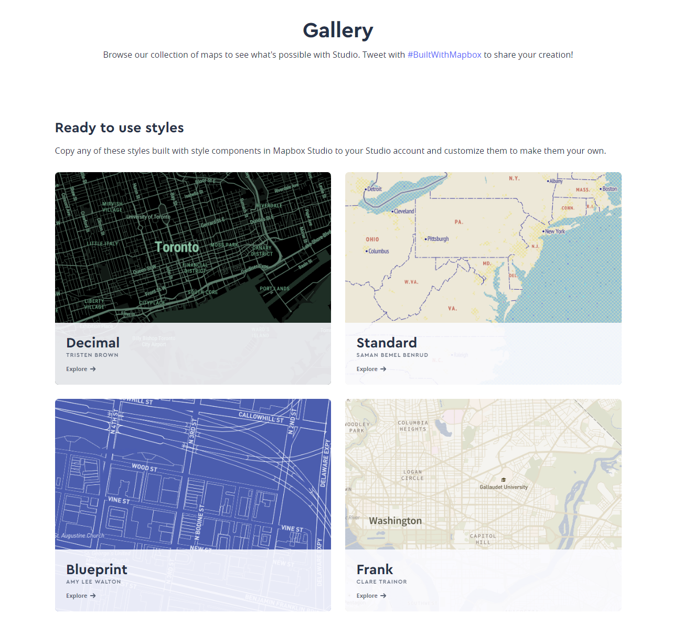

# Praticial Exercise 4: Creating geo-narratives with Mapbox storytelling library

**Meeting:** Wednesdays, 2:30 - 5:20, SMI 109

**Instructor:** Bo Zhao, SMI 416B, Office hours by appointment

**Contact:** 206.685.3846, zhaobo@uw.edu, jakobzhao (skype/wechat)

In this pratical exercise, you are expected to make a web based interactive storymap with a storytelling library from Mapbox. Geo-Narrative is an evolving concept in modern cartography and geovisualization, and has been frequently used by Geographers, GIScientists, and Data Journalists. It aims to use differenet geovisual approaches to narrate/represent a geographic phenomenon often in the form of web based interactive maps. From a practical perspective, an attractive and precise geo-narrative should use multiple media instead of only drawing maps. For example, pictures, videos, scripts, audio, and so on can also support the development of a geo-narrative. In recent years, with the convegence of geospatial, information and mobile techiniques, a geo-narrative are integrated with virtual reality, augumented reality, also supported by real-time geospatial data feeds.

**Mapbox storytelling library** is designed to accelerate building out a "scrollytelling" map story. The primary input is a story broken into sections (`chapters`), each hooked to a particular view of a map. You need to input a custom Mapbox Style with layers styled in Studio and toggle the layer's opacity. Below is an example of a geo-narrative made by this library.


You are expected to use `Atom` to make a geo-narrative onto a github repository. A geo-narrative is mainly comprised of html pages and javascript. You can also attach images or videos if needed. For third-party geospatial data, you can use geojson for vectors and WMS (Web Map Services) for rasters. Once the geo-narrative is made, you can synchronize these codes to the cloud side, the GitHub Pages can visualize the codes, and thereby publishing the geo-narratives.

## 1. Preparations

### 1.1 Mapbox registration

To configure and publish a story, you will need a Mapbox [access token](https://docs.mapbox.com/help/glossary/access-token). Please sign up for a free account at [mapbox.com](https://www.mapbox.com/signup/) to get one. You are recommended to use your `edu` email since there are more free resources for students and faculty members.

### 1.2 Map layers design

 Once you are registred, you can also create map layers on [Mapbox Studio](https://studio.mapbox.com). In general, you need to have two types of map layers, base maps (layers) and thematic map layers.

 - **(a)** For base maps, you can visit [mapbox gallery](https://www.mapbox.com/gallery/) for inspiration. I also attach a latest version of [The Guide to Map Design from Mapbox](the-guide-to-map-design.pdf) for your reference.

 

- **(b)** If you are planning to include some thematic map layers, you will need some familiarity with [Mapbox Studio](https://studio.mapbox.com). In most cases, you will need to familiar with how to upload and visualize geospatial data on mapbox.

## 2. Development procedure

In this section, you are expected to follow the steps in sequence in order to make a geo-narrative.


### 2.1 Project Initialization

Create a github repository, and clone it to your local workspace. In the local folder, please copy one of the examples under the [05_viz folder](05_viz). The example can be either the [Bike](bike.html), [Glacier](glacier.html), or [the US](us.html) project to the newly created local folder. For example, if you copy the bike example to the local folder, the structure should look like:

```powershell
[geo-narrative-repository]
    │ readme.md
    │ bike.html
    │readme.md
    ├─js
    │      config-bike.js
```

After you copy these files to the local folder, please change the `bike.html` to `index.html`, and `config-bike.js`  to `config.js`.

in the `index.html` file, please change the line `<script src="js/config-bike.js"></script>` to `<script src="js/config.js"></script>`.


### 2.2 Project Configuration

The config file is located in the `js` foder, it contains a javascript variable named `config`. Its structure looks like:

```JavaScript
var config = {
    style: 'mapbox://styles/mapbox/streets-v11',
    accessToken: 'YOUR_ACCESS_TOKEN',
    showMarkers: true,
    alignment: 'left',
    title: 'Story Title Goes Here',
    subtitle: 'A subtitle going into more detail goes here',
    byline: 'By a Digital Storyteller',
    footer: 'Sources and citations, etc. live down at the bottom of the story',
    chapters: [...]
  };
```

Notably, you need to select the map style for the base map (layer) for the geo-narrative. The default is Mapbox Streets, but you can find more here https://docs.mapbox.com/api/maps/#styles, or use one of your custom styles. Also, you need to add a Mapbox access token which you have applied in Section 1.

Moreover, you can choose (1) the alignment of the story script, (2) the theme of the script style,  (3) defining the title, subtitle and byline, and also (4) determine whether to add a header and/or footer.


### 2.3 Storytelling


At the end of the `config` variable, you can add a list of chapters to the array named `chapters`. A chapter structure looks like:


```javascript
{
    id: 'identifier',
    title: 'Title',
    image: './path/to/image/source.png',
    description: 'Copy these sections to add to your story.',
    location: {
        center: [-77.020636, 38.886900],
        zoom: 13.5,
        pitch: 60,
        bearing: -43.2
    },
    onChapterEnter: [
        {
            layer: 'mapbox-layer-a',
            opacity: 1
        }
    ],
    onChapterExit: [
        {
            layer: 'mapbox-layer-b',
            opacity: 0
        }
    ]
}
```

Most of the parameters are quite obvious. The location parameter can be identified through [https://demos.mapbox.com/location-helper](https://demos.mapbox.com/location-helper/).


### 2.4 Peer-review and Debug


Open `index.html` in a browser, and scroll. Voila!

## 3. Deliverable

You are expected to walk through this instructionm, study the three examples ([bike](bike.html), [glacier](glacier.html) and [us](us.html)), and make your own geo-narrative onto a github repository.

you need to submit the github repository url to the **Canvas Dropbox** of this course. This url should be in the format of `https://www.github.com/[github_username]/[geo-narrative-repository]`. Before submitting the deliverable, please make sure the **GitHub Pages** work properly. Please contact the instructor if you have any difficulty in submitting the url link. Here are the grading criteria:

1\. The `GitHub Pages` function of the repository should work properly. That said, your geo-narrative can be visited from `https://[github_username].github.io/[geo-narrative-repository]`, and there will be no errors if you open up the Chrome inspector (5 POINTS);

2\. In `readme.md` file, introduce your geo-narrative project. (15 POINTS)

3\. The repoistory structure should look like: (10 POINTS)

```powershell
[geo-narrative-repository]
    │ readme.md
    │ index.html
    │readme.md
    ├─js
    │      config.js
    ├─img
    │      XXX.png or jpg
    │      ... ... ...
    │      ... ... ...
```

4\. The storyline of the geo-narrative should be logical and make sense. (20 POINTS); and


**Note:** Lab assignments are required to be submitted electronically to Canvas unless stated otherwise. Efforts will be made to have them graded and returned within one week after they are submitted.Lab assignments are expected to be completed by the due date. ***A late penalty of at least 10 percentage units will be taken off each day after the due date.*** If you have a genuine reason(known medical condition, a pile-up of due assignments on other courses, ROTC,athletics teams, job interview, religious obligations etc.) for being unable to complete work on time, then some flexibility is possible. However, if in my judgment you could reasonably have let me know beforehand that there would likely be a delay, and then a late penalty will still be imposed if I don't hear from you until after the deadline has passed. For unforeseeable problems,I can be more flexible. If there are ongoing medical, personal, or other issues that are likely to affect your work all semester, then please arrange to see me to discuss the situation. There will be NO make-up exams except for circumstances like those above.


## Acknowledgments

* John Branigan on the Mapbox [Solutions Architecture Team](mailto:solutions_architecture@mapbox.com)
* Lo Bénichou for the idea, support, and awesome feedback throughout the design and build process
* Paige Moody and Lem Thornton for early testing and feedback
* Chris Toomey for ushering this work through and keeping things on track
* Journalists with stories that help us make sense of what goes around us

**The instruction of this exercise has learnt and even directly copied a few open-source Mapbox archives and documentations, but I made necessary edits to better facilite the course requirements and demands. If you believe it has viloated any Mapbox rules, please contact me via zhaobo@uw.edu.**
