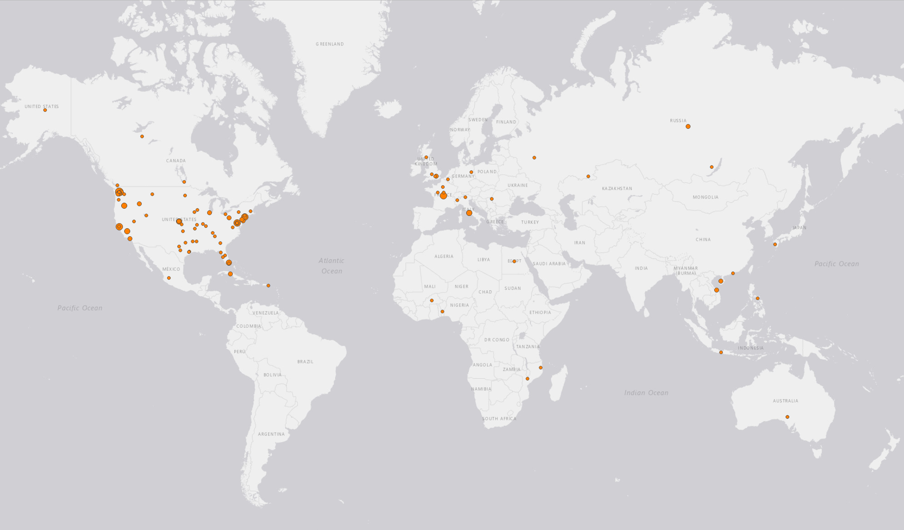
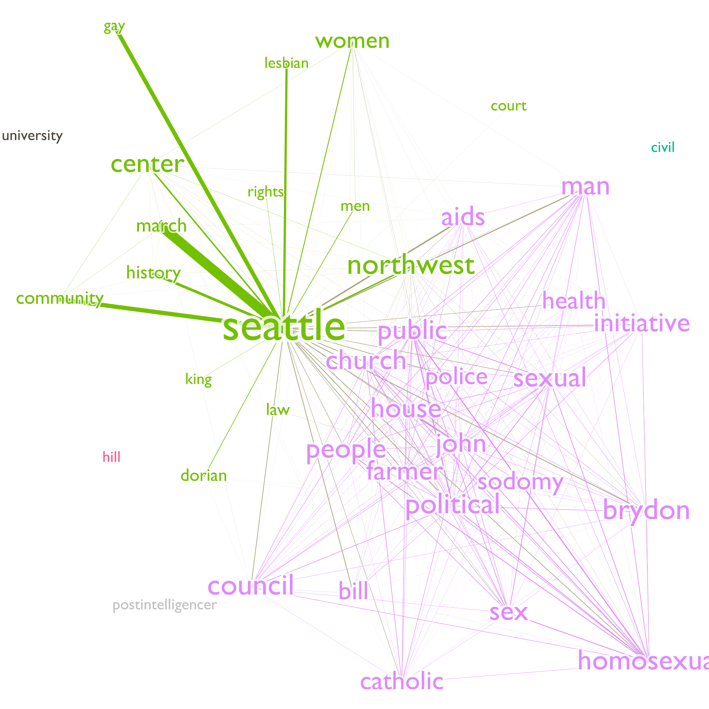

# Practical Exercise 5: Place context analysis using Natural Language Processing

**Meeting:** Wednesdays, 2:30 - 5:20, SMI 109

**Instructor:** Bo Zhao, SMI 416B, Office hours by appointment

**Contact:** 206.685.3846, zhaobo@uw.edu, jakobzhao (skype/wechat)

In this practical exercise, you are expected to use Natural Language Processing to explore a book author's sense of place about Seattle. Natural Language Processing (NLP), as a typical machine learning algorithm, aims to inteprete the context of a large text corpora with the support from insteading of a human being. Obviously, NLP can learn a large amount of text with ease, and can summarize its major context using multiple functions and analyses. Sense of place indicates an individual's perception, emotion,  or altitude towards a place. If an individual has recorded one's sense of place, it is possible to interprete the author's sense of place to process the record using NLP. Below, we will explore Gary L. Atkins's sense of place about Seattle. To do so, we will mainly use NLP to process his book entitled *Gay Seattle*. Specificially, we plan to explore multiple perspectives of Gary's sense of place. For example, we would like to get a general picture about his impression of Seaettle using word cloud, and then plot the spatial dimension of Gary's perception of `Seattle`, and then try to visualize Gary's sense of palce using network analysis. Let us get started!

## 1.  Environment Setup

This execerise will be conducted in a python programming environment. Before impelmenting this exerciese, a few python libraries are needed. To install, please execute the following line on command prompt or terminal.

```powershell
pip install PyMuPDF
pip install tika
pip install gensim
pip install spacy
pip install nltk
pip install wordcloud
python -m spacy download en_core_web_sm
```

To make sure NLTK can run property, you need to \download the NLTK corpora dataset.Run the Python interpreter and type the commands.

```Python
>>> import nltk
>>> nltk.download()
```

In addition to configure the python environment, install Gephi and QGIS 3.

Gephi is an open-source network analysis and visualization software package written in Java on the NetBeans platform. Gephi has been used in a number of research projects in academia, journalism and elsewhere, for instance in visualizing the global connectivity of New York Times content and examining Twitter network traffic during social unrest along with more traditional network analysis topics. Gephi is widely used within the digital humanities (in history, literature, political sciences, etc.), a community where many of its developers are involved.


## 2. Reading and Preprocessing PDF files

 In this section, we need to read all the pdf files of the book *Gay Seattle*, please download all the pdf files from the Google drive and store them in the folder named as `gay-seattle` under the `assets` folder. After migrating files, we need to delete the front page of each pdf file since this page, containing the meta data of the pdf file, is irrelevant to the maintext of this book. Then, the python script recognizes the text of each pdf file using a python library `pika`. In the end, all the text will be stored in an text file named `gay-seattle.txt`.

## 3. Making a Wordcloud


## 4. Spatial dimension of sense of place



## 5. Contextual dimension



## Deliverable


## References
* Thrush, C., 2017. Native Seattle: Histories from the crossing-over place. Accessed from https://muse.jhu.edu/book/10411. University of Washington Press.

* Atkins, G., 2011. Gay Seattle: Stories of exile and belonging. Accessed from https://muse.jhu.edu/book/40703. University of Washington Press.
